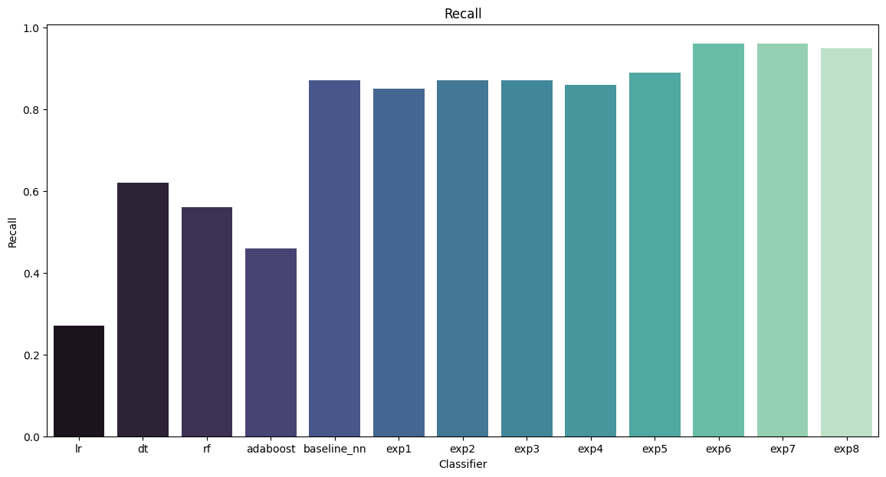
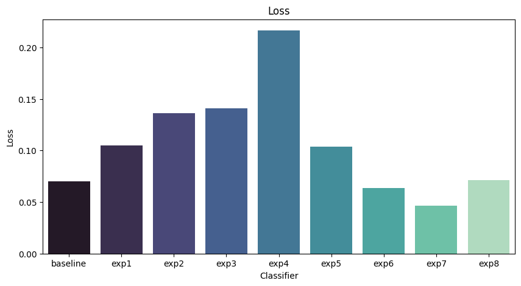
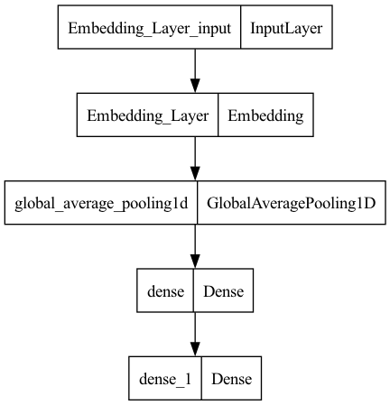

# Orange SPAM detector

## Company's Description 📇

AT&T Inc. is an American multinational telecommunications holding company headquartered at Whitacre Tower in Downtown Dallas, Texas. It is the world's largest telecommunications company by revenue and the third largest provider of mobile telephone services in the U.S. As of 2022, AT&T was ranked 13th on the Fortune 500 rankings of the largest United States corporations, with revenues of $168.8 billion! 😮

## Project 🚧

One of the main pain point that AT&T users are facing is constant exposure to SPAM messages.

AT&T has been able to manually flag spam messages for a time, but they are looking for an automated way of detecting spams to protect their users.

The goal is to build a spam detector, that can automatically flag spams as they come based solely on the sms' content.

## Built Models

4 Machine Learning models were built, as well as 9 different Deep Learning models. They are referred to as "experiments" in this project.

Each experiment had some tweaking from the previous one, such as adding a different type of layer or changing the parameters
in said layer. Some of the tweaking includes adding Dense layers, Dropout layers, increasing neurons, early stopping and 
increasing training data.

## Model Metrics

These are the results for each model on the validation set.

### Recall

### Binary Cross Entropy Loss

## Model Parameters

- Optimizer: Adam
- Loss: Binary Cross Entropy
- Metric: Accuracy
- Epochs: 30
- Positive Threshold: 0.50

## Best Model

Experiment 7 was the best model, as it had the highest true positive rate and lowest loss. Train-Val-Test Split: 80-10-10.

### Architecture

## Use Model

To import the model and use it, you may use the following code.

1. Open your computer's Command Line, or Terminal, and run this code.
   
   `git clone https://github.com/davidegc1/DeepLearning_AT-T.git`

2. Open the downloaded folder in the code editor of your choice.

3. Create a new notebook, where you would like to work. Once in there run this code.
   
`import joblib`

`model = joblib.load(att_deeplearning_model)`

4. Make predictions on your preprocessed data.
   This two pieces of code will make predictions on your data, where the threshold for a positive prediction (1) is of 0.50.
   Predictions will be stored on *prediction_labels* variable.

`predictions = model.predict(data)`
`prediction_labels = np.where(preds > 0.5, 1, 0)`

